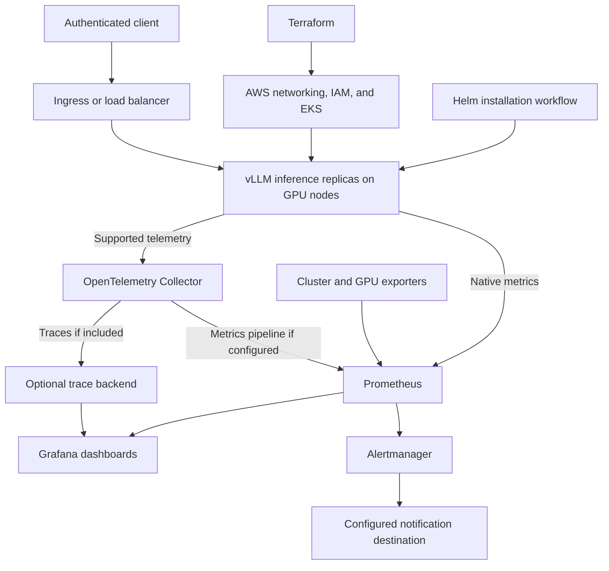

# Scalable LLM Inference Platform on AWS EKS

## Project description

Build a scalable, reproducible LLM inference platform using Amazon EKS, Terraform, Helm, and vLLM. The platform will provide a standardized deployment workflow: one Terraform apply to provision infrastructure, followed by a Helm installation workflow to deploy the model-serving and observability components.

The solution will support a broad range of vLLM-compatible LLMs through configuration, subject to model architecture, licensing, GPU memory, and compute capacity. The project will validate this approach with one reference model and document how to deploy additional compatible models.

Prometheus, OpenTelemetry, and Grafana will provide visibility into service performance and infrastructure health. The project will define service-level indicators (SLIs), establish service-level objectives (SLOs), draft a proposed service-level agreement (SLA), and implement tested alerts and response procedures.

The project will demonstrate measurable reliability and recovery. It does not promise failure-free operation or establish a contractual production SLA.

## Objectives

- Provision a reproducible AWS EKS environment using reusable Terraform modules.
- Deploy a configurable vLLM inference service through Helm.
- Scale inference replicas and GPU capacity within explicit budget and resource limits.
- Monitor service performance, model throughput, GPU resources, and cluster health.
- Establish measurable reliability targets and verify alert delivery and recovery behavior.
- Deliver documentation and validation evidence that support replication and future production planning.

## Scope and deliverables

### Infrastructure as code

- Terraform configuration for networking, EKS, IAM permissions, CPU and GPU node capacity, and supporting infrastructure.
- Configurable AWS region, instance types, capacity limits, and environment settings.
- Version pinning, remote state configuration, and deployment and teardown instructions.
- Documented prerequisites, including AWS credentials, service quotas, GPU availability, and model access credentials when required.

### Model serving

- A Helm-based vLLM deployment with configurable model selection, GPU allocation, inference settings, and replica counts.
- Startup, readiness, and liveness checks appropriate to model loading times.
- An authenticated inference endpoint and a documented request example.
- Reference model deployment and guidance for substituting another compatible model.

### Scalability and resilience

- Inference replica scaling and cluster capacity scaling with explicit minimum and maximum capacity.
- Load distribution and resource requests and limits.
- Validation of increased traffic, pod failures, node failures, and capacity changes.
- Documentation of model download, loading, and GPU provisioning delays that affect scaling and recovery.

### Observability

- Prometheus for metrics collection, recording rules, and alert evaluation.
- OpenTelemetry Collector for supported instrumentation and telemetry collection.
- Grafana dashboards for inference performance, reliability, GPU utilization, and cluster health.
- Metrics for request success, time to first token, time between tokens, end-to-end latency, token throughput, queue depth, and resource saturation.
- GPU metrics collected through an appropriate exporter.

vLLM exposes native Prometheus metrics and supports OpenTelemetry tracing. Prometheus can scrape native metrics directly; the Collector is configured for the telemetry pipelines selected for the platform. If retained, queryable traces are included, a trace backend must also be selected and deployed. Grafana alone does not provide trace storage.

### Operational readiness

- Alert rules, notification routing, severity definitions, and incident runbooks.
- Basic endpoint authentication, access controls, and secret-handling guidance.
- Capacity and cost guidance based on benchmark results.
- Deployment, verification, troubleshooting, and teardown documentation.

## Proposed architecture

The infrastructure provisioning step must complete before Helm connects to the new cluster. Reproducibility assumes the documented prerequisites are already satisfied. Exact scaling components, GPU instance types, chart versions, and telemetry pipelines will be chosen during implementation and recorded in this document.

## Reliability: SLIs, SLOs, and SLA

### Measurement boundaries

Reliability targets apply to a documented reference workload. Record the model and revision, GPU configuration, concurrency, input and output token lengths, streaming mode, timeout policy, and test duration. Define eligible requests and classify client errors, rejected requests, server errors, timeouts, and interrupted streams explicitly.

Measure user-visible behavior at the service boundary where possible. A successful streaming request must complete successfully; an initial successful HTTP response alone is insufficient. Document how measurements account for traffic that fails before reaching vLLM.

### Service-level indicators and objectives

| Area | SLI | SLO definition |
| --- | --- | --- |
| Availability | Eligible requests completed successfully divided by all eligible requests | Agreed success-rate target over a defined measurement window |
| Responsiveness | Time to first token and time between generated tokens | Agreed thresholds met by a defined proportion of eligible requests |
| Completion latency | End-to-end request duration | Agreed latency threshold for the reference workload |
| Recovery | Time to restore healthy serving after an injected failure | Recovery within an agreed duration for each tested failure scenario |

Targets are pending baseline measurements and stakeholder agreement. Capacity diagnostics such as GPU utilization and queue depth support investigation and scaling; they are not substitutes for user-facing SLIs.

### Error budgets and alerts

- Calculate error budgets from the agreed SLOs and measurement windows.
- Implement alerts for excessive error-budget consumption across short and long windows.
- Add operational alerts for unavailable replicas, latency degradation, growing queues, GPU memory pressure, and node or resource saturation.
- Define severity, routing, ownership, and response instructions for actionable alerts.
- Test alert evaluation, delivery, recovery notifications, and the associated runbooks.

Alerts detect degradation and support response; scaling, capacity planning, and recovery mechanisms contribute to achieving the objectives.

### Proposed SLA

Draft the service commitment, measurement rules, exclusions, support responsibilities, and breach-handling process. Any production or contractual SLA requires stakeholder approval and longer-term operational evidence. A short validation test validates behavior during its test window; it cannot establish long-term availability by itself.

## Implementation waves

Each wave produces version-controlled configuration and concise validation evidence. Later waves build on the verified results of earlier waves.

| Wave | Focus | Deliverables and completion criteria |
| --- | --- | --- |
| **Wave 1: Infrastructure provisioning with Terraform** | Create the AWS infrastructure. | Provision networking, IAM, EKS, CPU and GPU node groups, and Terraform state management. Verify cluster access, GPU availability, and reproducible deployment and teardown. |
| **Wave 2: Prometheus and OpenTelemetry setup** | Establish telemetry collection. | Install Prometheus and the OpenTelemetry Collector through Helm. Configure infrastructure metrics collection, retention, and service discovery. Verify telemetry ingestion; connect vLLM telemetry in Wave 4. |
| **Wave 3: Grafana setup** | Make platform health visible. | Deploy Grafana, configure Prometheus as a data source, and provision dashboards for cluster health, resource consumption, and GPU capacity. |
| **Wave 4: vLLM deployment and model serving** | Deliver a functioning inference service. | Deploy vLLM through a configurable Helm chart, load the reference model, configure GPU allocation and health checks, and expose an authenticated inference endpoint. Connect inference metrics to Prometheus and Grafana. |
| **Wave 5: Scalability and resilience** | Adapt serving capacity to demand. | Configure inference replica scaling and GPU node capacity scaling, resource limits, and workload distribution. Validate scaling under load and recovery from pod and node failures. |
| **Wave 6: SLIs, SLOs, and proposed SLA** | Define measurable service expectations. | Benchmark the reference workload, define SLI measurement rules, establish SLO targets and error budgets, and draft the SLA with responsibilities, exclusions, and breach-handling procedures. |
| **Wave 7: Alerting and operational response** | Detect and respond to service degradation. | Configure error-budget, availability, latency, and capacity alerts. Establish notification routing and incident runbooks, then verify alert delivery through controlled failure scenarios. |
| **Wave 8: End-to-end validation and handover** | Demonstrate reproducibility and acceptance criteria. | Deploy from a clean environment using the Terraform and Helm workflow. Run load and recovery tests, assess SLO results, and deliver deployment documentation, benchmark findings, cost guidance, and recommendations for production readiness. |

The Helm installation workflow may orchestrate multiple pinned charts and releases. Whether this uses an umbrella chart or a deployment wrapper will be decided during implementation; the user-facing workflow must remain documented and reproducible.

## Acceptance criteria

1. Deploy the platform into a prepared AWS account through the documented Terraform and Helm workflow, without undocumented manual configuration.
2. Serve successful inference requests using the reference model and verify endpoint authentication.
3. Demonstrate replica and infrastructure scaling within configured capacity limits.
4. Display service, model, GPU, and cluster metrics in Grafana.
5. Validate SLI calculations, SLO dashboards, alert delivery, and recovery procedures through load and failure testing.
6. Demonstrate deployment in a clean environment and teardown of provisioned resources, with retained state or data exceptions explicitly documented.
7. Deliver reusable code, configuration examples, benchmark results, operational documentation, and production-readiness recommendations.

## Project boundaries

The initial scope covers one AWS region, one reference model deployment, and a defined workload. Model training, fine-tuning, universal model compatibility, multi-region disaster recovery, advanced multi-tenancy, and contractual production guarantees are outside the initial scope.

Multi-node distributed inference is not assumed for the reference deployment and requires a separate scope decision if the selected model cannot fit the chosen serving configuration. Model output quality evaluation is also outside the infrastructure reliability scope.

## Decisions to finalize during implementation

- AWS region, GPU instance types, quotas, capacity availability, and budget limits.
- Reference model, immutable revision, license, and access requirements.
- Supported Terraform, Kubernetes, Helm chart, and vLLM versions.
- GPU device management and GPU metrics exporter.
- Inference replica scaling signals and cluster scaling component.
- Ingress, authentication, TLS, and secret delivery mechanisms.
- Metric retention, storage capacity, and optional trace backend.
- Benchmark workload, SLO thresholds, measurement windows, and alert destination.

## References

- [vLLM metrics and OpenTelemetry tracing](https://docs.vllm.ai/en/latest/design/metrics/)
- [NVIDIA GPU device management on Amazon EKS](https://docs.aws.amazon.com/eks/latest/userguide/device-management-nvidia-dra-device-plugin.html)

## Current status

This repository currently documents the project design and implementation scope. Infrastructure, Helm deployments, dashboards, alerts, and benchmark automation will be implemented in the waves above.
